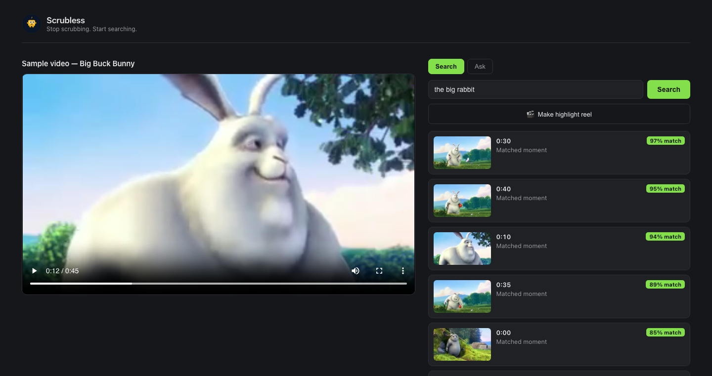

## The problem

**Video is the one medium you still can't search.**

- 500+ hours are uploaded to YouTube *every minute* — and that's one platform.
- Inside any single video, finding a moment means \alert{scrubbing}: linear,
  manual, slow.
- `Ctrl+F` solved this for text 40 years ago. There's still none for video.

\vspace{0.5em}
\begin{center}
\alert{\large\textbf{Editors lose up to a third of post-production}}\\[2pt]
just \emph{finding} the right footage — before a single cut.
\end{center}

## The solution

**Scrubless is `Ctrl+F` for video.**

- Upload a video — or point Scrubless at a whole folder of them.
- Search in plain English: *"the part where someone is laughing."*
- Click a result and the player jumps to that \alert{exact second}.
- It searches what's **shown** and what's **said** — not just captions.

## Live today — and it works

\vspace{-0.2em}

{width=84%}

\vspace{-0.3em}
\footnotesize Real search on **getscrubless.com**: *"the big rabbit"* → ranked
moments with match scores; click one, the player jumps to that second. **Shipped
to production — not a prototype.**

## How it works

One pipeline turns every video into three searchable signals.

{width=92%}

\footnotesize
Frames become **CLIP** vectors (the visuals), audio becomes a **Whisper**
transcript (the words), and **Claude** turns retrieved moments into cited
answers. One search box over all of it.

## More than search

Once a video is indexed, the hard part is done — everything else is free.

- **Library mode** — search across an *entire folder* of videos at once.
- **Ask** — questions answered in prose, with clickable cited timestamps.
- **Auto-chapters & summaries** generated on every upload.
- **Highlight reels** — stitch the best moments into a shareable clip.

> Index once. Search, ask, summarize, and cut — from the same index.

## Why now

The pieces only just became cheap enough to put in one small app.

- **Multimodal embeddings** (CLIP) are good, fast, and open.
- **Whisper** drove transcription cost toward zero.
- **LLMs** (Claude) can now reason over retrieved moments and cite them.
- **Video volume** is compounding while tooling stays stuck on scrubbing.

\alert{The tech is finally ready — and we've already shipped on it.}

## Market

:::: columns
::: {.column width="50%"}
{width=100%}
:::
::: {.column width="48%"}
\vspace{1.2em}

**TAM ≈ \$30B / year** — the spend on making video findable.

\small

- **Bottom-up:** 50M creators × \$240/yr **+** 30M businesses × \$600/yr.
- **Beachhead:** 20K heavy-library creators → **≈\$4.8M ARR** reachable now; SOM 200K → **≈\$48M**.
- **Cross-check:** DAM ≈\$5B · search ≈\$6B · video intelligence ≈\$11B — same order of magnitude.
:::
::::

## Traction

**Shipped and live** at getscrubless.com:

- V1 search, V2 library mode, V3 Q&A / chapters / reels — all in production.
- Auth + Stripe billing working; durable per-user storage.

**Targets — next two quarters, post public launch:**

- **1,000** signups in the first 90 days (Show HN / Product Hunt).
- **100** paying customers and **\$2K MRR** by end of Q3 2026.
- **10,000** hours of video indexed.
- **40%** week-4 retention on activated users.

## Business model

Freemium SaaS, priced on what costs us money: **indexed hours**.

- **Free** — a few minutes to feel the magic.
- **Pro** — monthly plan by indexed hours, self-serve via Stripe.
- **Expansion** — team seats, API access, on-prem / enterprise.

\footnotesize Cheap to run: one process, model and vector DB in-memory, fits on a
single small instance — gross margin is on our side.

## Competition

:::: columns
::: {.column width="58%"}
{width=100%}
:::
::: {.column width="40%"}
\vspace{1.4em}

Everyone else finds **words** or needs **manual tags**.

\small Scrubless searches what's **shown** *and* **said** — semantic, instant,
on *your own* files. Top-right, and alone there.
:::
::::

## Why we win

- **Multimodal, not transcript-only** — we search the pixels *and* the audio;
  competitors are blind to anything unspoken.
- **Live and billed today** — a shipped product, while most "AI video search" is
  still a waitlist.
- **Built on real embedding infra** — the founder ships ML/embedding systems in
  production; the hard part is home turf.
- **Index once, do everything** — search, ask, chapters, reels off one index →
  widening surface area and switching cost.

\vspace{0.2em}
\alert{The capability is commoditizing — the product, polish, and data flywheel are not.}

## Team

**Chukwuebuka Ernest-Opara** — founder & sole engineer · Oakland.

- **ML & Platform Engineer at GEICO** — ships **embedding infrastructure** and ML
  deployment pipelines in production (Go · Python · Azure ML · Kubernetes).
- **Videographer for several years** before tech — has lived the scrubbing
  problem first-hand.
- **MS & BS in Computer Science** (Houston-Victoria; Babcock).
- Built **all of Scrubless solo** — V1–V3, auth, and Stripe billing.

\vspace{0.3em}
**In talks with two co-founders** with media experience to lead content and
go-to-market.

\footnotesize Built the embedding engine *and* lived the problem it solves —
rare founder-market fit for video.

## Vision

**The index layer for the world's video.** Every clip, meeting, lecture, and
archive — instantly searchable, anywhere it lives.

\vspace{0.4em}
Search was the gateway to the web. Scrubless is that gateway for video.

\vspace{1.2em}
\begin{center}
\alert{\Large Stop scrubbing. Start searching.}
\end{center}

\vspace{0.8em}
\begin{center}
\footnotesize getscrubless.com \quad·\quad e@getscrubless.com
\end{center}
